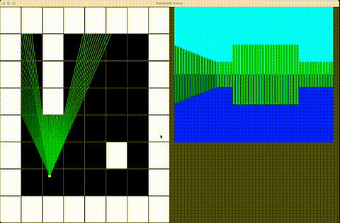

# OpenGL-Raycaster_v1

This is the code from my YouTube video!  
I still recommend watching the video so you follow along and see what each part does and how it works but here is the code if you need help. Thank you for the support, positive feedback, and comments!  
Note: Keep the window size the same as it opens to look correct.

https://www.youtube.com/watch?v=gYRrGTC7GtA

YouTube-3DSage

---

### To compile and run:

1. As a **vcpkg user**, you can install dependencies using the package manager:
   - **vcpkg** is a package manager for C++ libraries, and I use it to manage and install dependencies for this project.
   - To install `vcpkg`, follow the instructions on the official [vcpkg GitHub page](https://github.com/microsoft/vcpkg).
   - Once installed, you can use `vcpkg` to install dependencies, for example:
     ```bash
     ./vcpkg install <package_name>
     ```

2. Create a build directory:  
   ```bash
   mkdir build_dir
   ```

3. Change to the build directory:  
   ```bash
   cd build_dir
   ```

4. Run CMake to configure the project:  
   ```bash
   cmake ..
   ```

5. Build the project using Make:  
   ```bash
   make
   ```
---

### Demo

